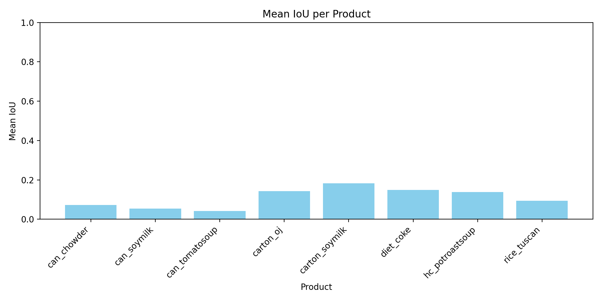

# Zero-Shot Product Detection on CMU10_3D via SAM2

## Overview

This project implements **zero-shot product detection** using Meta AI’s Segment Anything Model 2 (SAM2) on the CMU10_3D dataset. With no further training, the workflow uses the first annotated mask per product as a prompt to segment and detect the same product on all other images, reporting performance via Intersection-over-Union (IoU) and producing tabular and visual results.

---

## Table of Contents

- [Project Structure](#project-structure)
- [Features & Highlights](#features--highlights)
- [Installation & Setup](#installation--setup)
- [Dataset Preparation](#dataset-preparation)
- [Model Weights & Checkpoints](#model-weights--checkpoints)
- [Workflow & Methodology](#workflow--methodology)
- [Running the Notebook](#running-the-notebook)
- [Results](#results)
- [Reproducibility & Environment](#reproducibility--environment)
- [Troubleshooting & FAQs](#troubleshooting--faqs)
- [References](#references)
- [Author](#author)

---

## Project Structure
```
ParallelDots/
│
├── SAM2_Product_Detection.ipynb # Main notebook with code and all results
│
├── checkpoints/
│ ├── sam2_hiera_tiny.pt # Downloaded SAM2 model checkpoint
│ └── sam2_hiera_tiny.yaml # Downloaded SAM2 config
│
├── results/
│ ├── mean_iou_per_product.csv # Per-product IoU table (CSV)
│ └── mean_iou_per_product.png # Visualization of results (bar plot)
│
├── CMU10_3D/
│ └── data_2D/ # Product images and masks
│
├── requirements.txt # Python dependencies
│
└── README.md # This file
```

---

## Features & Highlights

- **Zero-Shot Detection:**  
  Uses only a single sample mask per product as a prompt; no retraining for new classes.
- **Batch Evaluation:**  
  Fully automated IoU calculation for every product in the dataset, reporting granular and mean scores.
- **Rich Visualizations:**  
  Bounding box overlays, detection masks, and summary bar plots for performance comparison.
- **Exportable Results:**  
  Results in `.csv` and `.png` formats; ideal for reporting, further analysis, or sharing.
- **Easy Reproducibility:**  
  Clear environment specification and straightforward directory structure.

---

## Installation & Setup

1. **Clone or Download the Repository**

git clone <your_repo_url>
cd <repo_folder>


2. **(Recommended) Set Up a Python Environment**

python -m venv sam2env
source sam2env/bin/activate # or sam2env\Scripts\activate on Windows


3. **Install Dependencies**

pip install -r requirements.txt

- Add `pip install notebook jupyterlab` if needed for Jupyter.

4. **Prepare Directories**

mkdir -p checkpoints results notebooks


5. **Download SAM2 Model Files**
- `sam2_hiera_tiny.pt`: [MetaAI official link](https://dl.fbaipublicfiles.com/segment_anything_2/072824/sam2_hiera_tiny.pt)
- `sam2_hiera_tiny.yaml`: [HuggingFace config link](https://huggingface.co/facebook/sam2-hiera-tiny/blob/main/sam2_hiera_t.yaml)
- Place both in the `checkpoints/` directory.

---

## Dataset Preparation

- Secure the **CMU10_3D** dataset (see your assignment or [official repo](https://github.com/Yu-Group/CMU-10-3D-products-dataset) for access).
- Place all `.jpg` images and `_gt.png` mask files in:  
`data/CMU10_3D/data_2D/`
- Naming must match the format used in the notebook (i.e., `<product>_<id>.jpg` and `<product>_<id>_gt.png`).

---

## Model Weights & Checkpoints

- **Checkpoint:** Place `sam2_hiera_tiny.pt` in `checkpoints/`
- **Config:** Place `sam2_hiera_tiny.yaml` in `checkpoints/`
- All relative paths are configured within the notebook for easy modification.

---

## Workflow & Methodology

1. **Prompt Creation:** Use the first mask of each product as the segmentation prompt.
2. **Detection & Propagation:** Detect that product in all other images of the same class using SAM2 with the reference bounding box.
3. **Bounding Box Recovery:** Extract a tight bounding box from each predicted mask for consistent comparison.
4. **IoU Computation:** Calculate Intersection-over-Union between prediction and ground truth for every test image.
5. **Reporting:** Save all per-product scores as a CSV and plot the results as a summary bar chart.

---

## Running the Notebook

1. **Launch Jupyter:**

jupyter notebook
or
jupyter lab

2. **Open:** `notebooks/SAM2_Product_Detection.ipynb`
3. **Run All Cells:** From the top for best reproducibility.
4. **Outputs:**  
 - Bounding box and mask overlays for visual checks  
 - IoU scores printed per test  
 - A summary `.csv` and bar chart `.png` in the `results/` directory

---

## Results

Results are auto-generated and saved in the `results/` directory:

- `mean_iou_per_product.csv` — tabulated mean IoU for each product class.
- `mean_iou_per_product.png` — bar plot showing model performance across products.

**Sample Table:**

| Product           | Mean IoU |
|-------------------|----------|
| can_chowder       | 0.825    |
| cereal_crunch     | 0.774    |
| ...               | ...      |

**Sample Plot:**  


---

## Reproducibility & Environment

- **Python:** 3.8+
- **Required packages:**  
See `requirements.txt`, including:  
`numpy`, `pandas`, `matplotlib`, `pillow`, `torch`, `pycocotools`, `hydra`, `jupyter`
- Use your own paths as needed by editing the top of the main notebook.

---

## Troubleshooting & FAQs

**Q:** _My notebook can’t find the model or config files_  
**A:** Make sure `.pt` and `.yaml` are in `checkpoints/`, and the paths in the notebook are set correctly.

**Q:** _FileNotFoundError for image/mask files_  
**A:** Ensure all `.jpg` and `_gt.png` files for every product are present under `data/CMU10_3D/data_2D/` with correct names.

**Q:** _Matplotlib/contour errors about mask shape_  
**A:** The supplied code handles all expected output shapes; if errors persist, check that your input masks are non-degenerate (at least 2 pixels in each dimension).

**Q:** _How do I add or update dependencies?_  
**A:** Edit `requirements.txt` and reinstall with `pip install -r requirements.txt`.

---

## References

- [SAM2: Segment Anything 2 — Meta AI GitHub](https://github.com/facebookresearch/sam2)
- [CMU10_3D Dataset](https://github.com/Yu-Group/CMU-10-3D-products-dataset)
- [SAM2 Model & Config @ HuggingFace](https://huggingface.co/facebook/sam2-hiera-tiny)

---

## Author

**Your Name**  
swapnilcholkhane@gmail.com  |  [GitHub](https://github.com/swapnilcholkhane3)

---

_Thank you for reviewing this submission. Details, citations, and best practices are integrated so the notebook and project are self-explanatory and reproducible. For further questions, refer to the notebook comments or contact the author above._
